# Bub 深度解析

> **仓库**: https://github.com/PsiACE/bub  
> **作者**: PsiACE  
> **定位**: 基于 `republic` 的 Coding Agent CLI

---

## 1. 核心设计理念

Bub 的设计目标是**真实工程工作流** —— 强调可预测、可检查、可恢复。

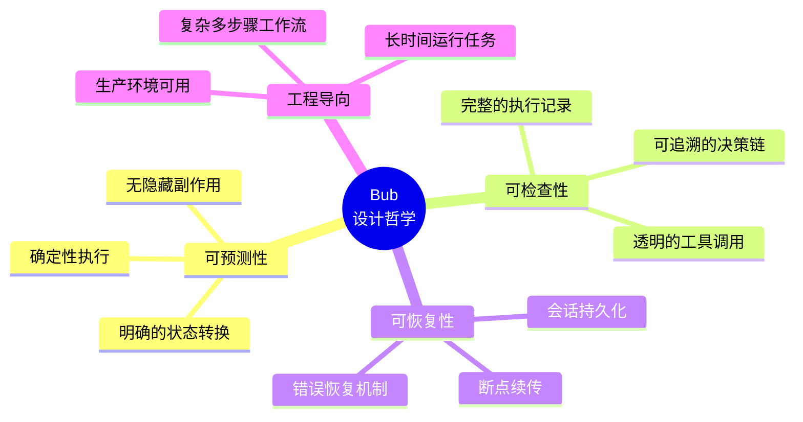
```mermaid
mindmap
  root((Bub<br/>设计哲学))
    可预测性
      确定性执行
      明确的状态转换
      无隐藏副作用
    可检查性
      完整的执行记录
      可追溯的决策链
      透明的工具调用
    可恢复性
      会话持久化
      断点续传
      错误恢复机制
    工程导向
      长时间运行任务
      复杂多步骤工作流
      生产环境可用
```

---

## 2. 整体架构

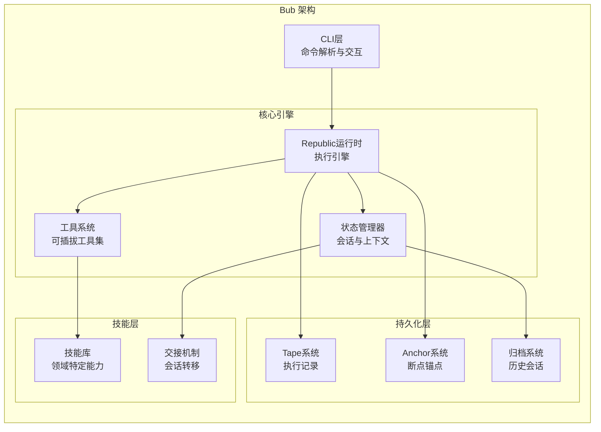
```mermaid
graph TB
    subgraph "Bub 架构"
        direction TB
        
        CLI[CLI层<br/>命令解析与交互]
        
        subgraph "核心引擎"
            Republic[Republic运行时<br/>执行引擎]
            State[状态管理器<br/>会话与上下文]
            Tool[工具系统<br/>可插拔工具集]
        end
        
        subgraph "持久化层"
            Tape[Tape系统<br/>执行记录]
            Anchor[Anchor系统<br/>断点锚点]
            Archive[归档系统<br/>历史会话]
        end
        
        subgraph "技能层"
            Skills[技能库<br/>领域特定能力]
            Handoff[交接机制<br/>会话转移]
        end
    end
    
    CLI --> Republic
    Republic --> State
    Republic --> Tool
    
    Republic --> Tape
    Republic --> Anchor
    State --> Archive
    
    Tool --> Skills
    State --> Handoff
```

---

## 3. Republic 运行时详解

Republic 是 Bub 的底层执行引擎，提供可靠的 Agent 运行环境。

### 3.1 执行模型

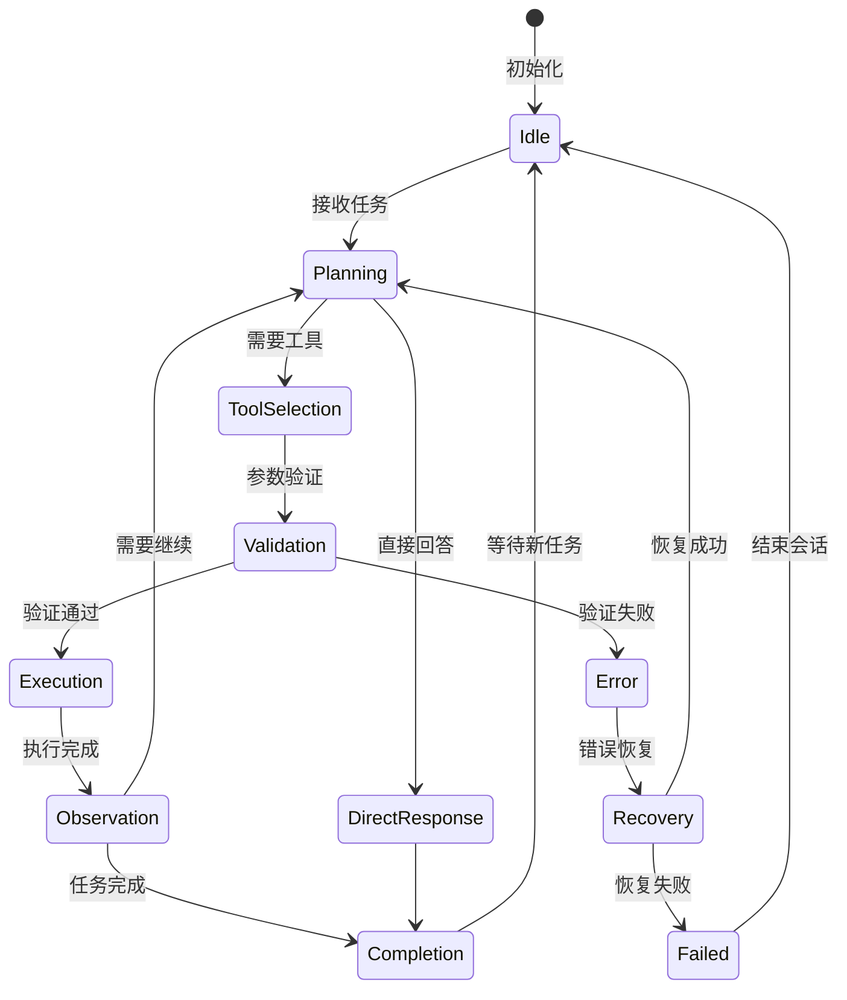
```mermaid
stateDiagram-v2
    [*] --> Idle: 初始化
    
    Idle --> Planning: 接收任务
    
    Planning --> ToolSelection: 需要工具
    Planning --> DirectResponse: 直接回答
    
    ToolSelection --> Validation: 参数验证
    Validation --> Execution: 验证通过
    Validation --> Error: 验证失败
    
    Execution --> Observation: 执行完成
    Error --> Recovery: 错误恢复
    
    Observation --> Planning: 需要继续
    Observation --> Completion: 任务完成
    
    Recovery --> Planning: 恢复成功
    Recovery --> Failed: 恢复失败
    
    DirectResponse --> Completion
    Completion --> Idle: 等待新任务
    Failed --> Idle: 结束会话
```

---

### 3.2 确定性执行保证

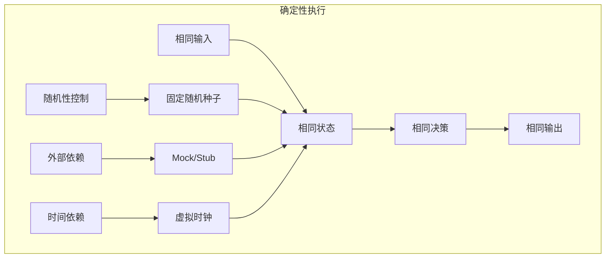
```mermaid
graph TB
    subgraph "确定性执行"
        A[相同输入] --> B[相同状态]
        B --> C[相同决策]
        C --> D[相同输出]
        
        E[随机性控制] --> F[固定随机种子]
        G[外部依赖] --> H[Mock/Stub]
        I[时间依赖] --> J[虚拟时钟]
        
        F --> B
        H --> B
        J --> B
    end
```

**实现机制**:
- 固定 LLM 的 temperature=0
- 工具调用结果缓存
- 外部系统状态快照
- 时间戳虚拟化

---

## 4. Tape 系统：执行记录与回放

Tape 是 Bub 的核心创新之一，完整记录 Agent 的执行过程。

### 4.1 Tape 结构

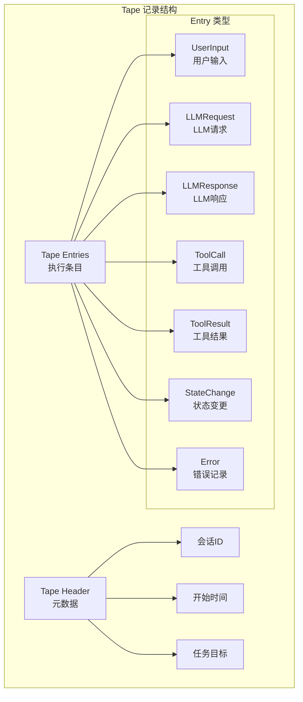
```mermaid
graph TB
    subgraph "Tape 记录结构"
        Header[Tape Header<br/>元数据]
        
        Header --> Session[会话ID]
        Header --> Timestamp[开始时间]
        Header --> Goal[任务目标]
        
        Entries[Tape Entries<br/>执行条目]
        
        subgraph "Entry 类型"
            E1[UserInput<br/>用户输入]
            E2[LLMRequest<br/>LLM请求]
            E3[LLMResponse<br/>LLM响应]
            E4[ToolCall<br/>工具调用]
            E5[ToolResult<br/>工具结果]
            E6[StateChange<br/>状态变更]
            E7[Error<br/>错误记录]
        end
        
        Entries --> E1
        Entries --> E2
        Entries --> E3
        Entries --> E4
        Entries --> E5
        Entries --> E6
        Entries --> E7
    end
```

---

### 4.2 执行回放机制

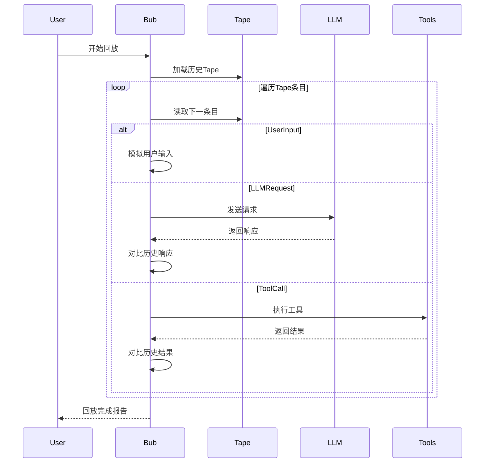
```mermaid
sequenceDiagram
    participant User
    participant Bub
    participant Tape
    participant LLM
    participant Tools
    
    User->>Bub: 开始回放
    Bub->>Tape: 加载历史Tape
    
    loop 遍历Tape条目
        Bub->>Tape: 读取下一条目
        
        alt UserInput
            Bub->>Bub: 模拟用户输入
        else LLMRequest
            Bub->>LLM: 发送请求
            LLM-->>Bub: 返回响应
            Bub->>Bub: 对比历史响应
        else ToolCall
            Bub->>Tools: 执行工具
            Tools-->>Bub: 返回结果
            Bub->>Bub: 对比历史结果
        end
    end
    
    Bub-->>User: 回放完成报告
```

**应用场景**:
- **调试**: 复现问题现场
- **审计**: 完整的执行轨迹
- **测试**: 回归测试基线
- **学习**: 分析决策过程

---

### 4.3 Tape 查询与分析

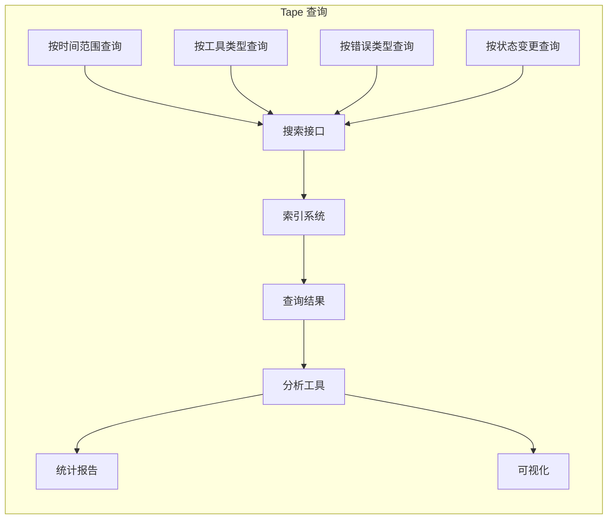
```mermaid
graph LR
    subgraph "Tape 查询"
        Q1[按时间范围查询]
        Q2[按工具类型查询]
        Q3[按错误类型查询]
        Q4[按状态变更查询]
        
        Q1 --> Search[搜索接口]
        Q2 --> Search
        Q3 --> Search
        Q4 --> Search
        
        Search --> Index[索引系统]
        Index --> Results[查询结果]
        
        Results --> Analysis[分析工具]
        Analysis --> Stats[统计报告]
        Analysis --> Viz[可视化]
    end
```

**命令示例**:
```
,tape.search query=error      # 搜索错误记录
,tape.info                    # 显示Tape统计
,tape.reset archive=true      # 重置并归档
```

---

## 5. Anchor 系统：断点与恢复

Anchor 允许在任意时刻保存会话状态，并在之后恢复。

### 5.1 锚点生命周期

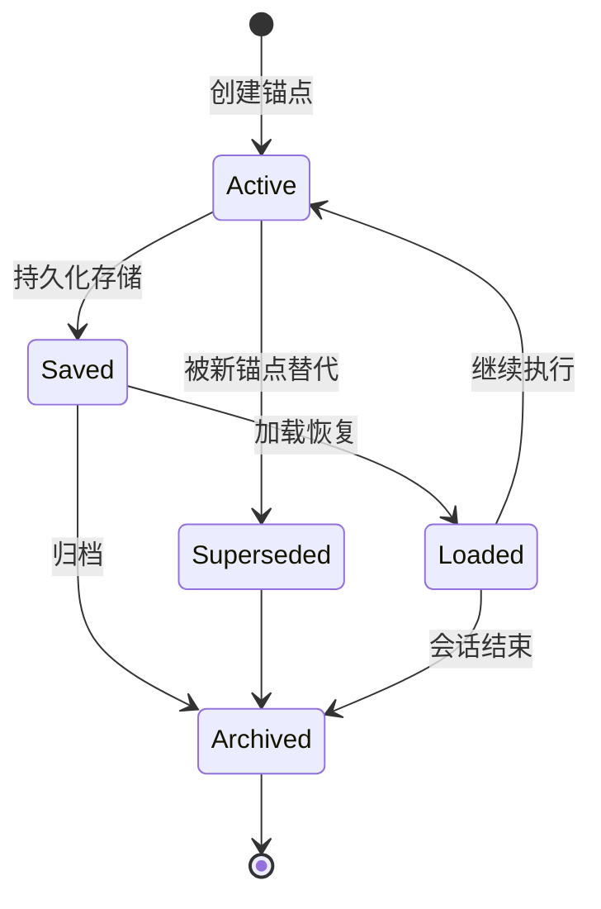
```mermaid
stateDiagram-v2
    [*] --> Active: 创建锚点
    
    Active --> Saved: 持久化存储
    Saved --> Loaded: 加载恢复
    Loaded --> Active: 继续执行
    
    Active --> Superseded: 被新锚点替代
    Saved --> Archived: 归档
    
    Superseded --> Archived
    Loaded --> Archived: 会话结束
    
    Archived --> [*]
```

---

### 5.2 锚点数据结构

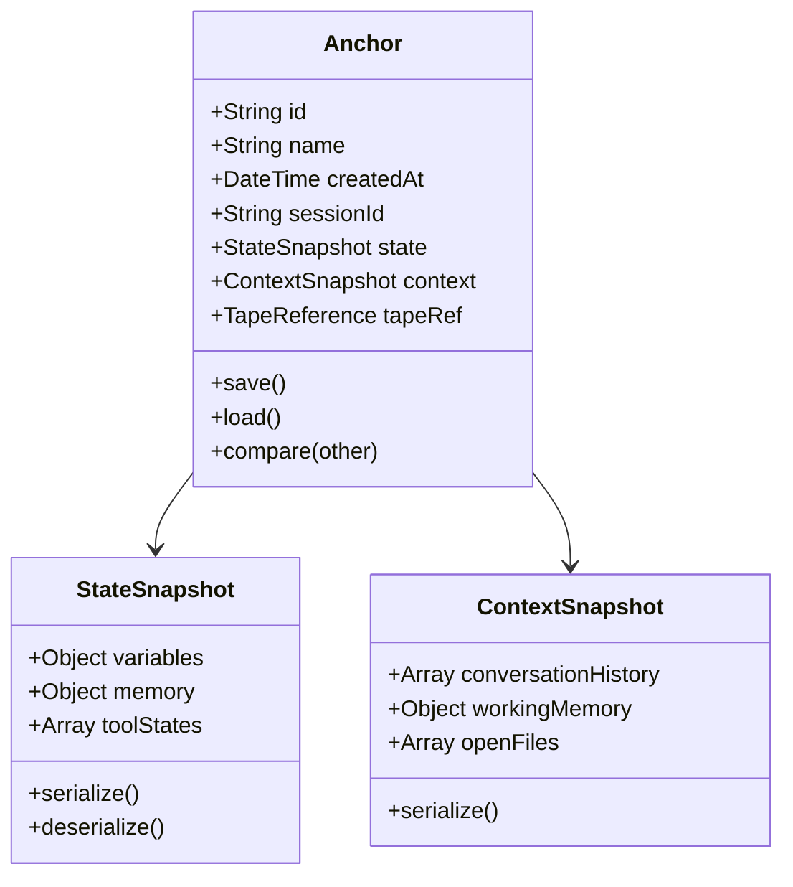
```mermaid
classDiagram
    class Anchor {
        +String id
        +String name
        +DateTime createdAt
        +String sessionId
        +StateSnapshot state
        +ContextSnapshot context
        +TapeReference tapeRef
        +save()
        +load()
        +compare(other)
    }
    
    class StateSnapshot {
        +Object variables
        +Object memory
        +Array toolStates
        +serialize()
        +deserialize()
    }
    
    class ContextSnapshot {
        +Array conversationHistory
        +Object workingMemory
        +Array openFiles
        +serialize()
    }
    
    Anchor --> StateSnapshot
    Anchor --> ContextSnapshot
```

---

### 5.3 断点恢复流程

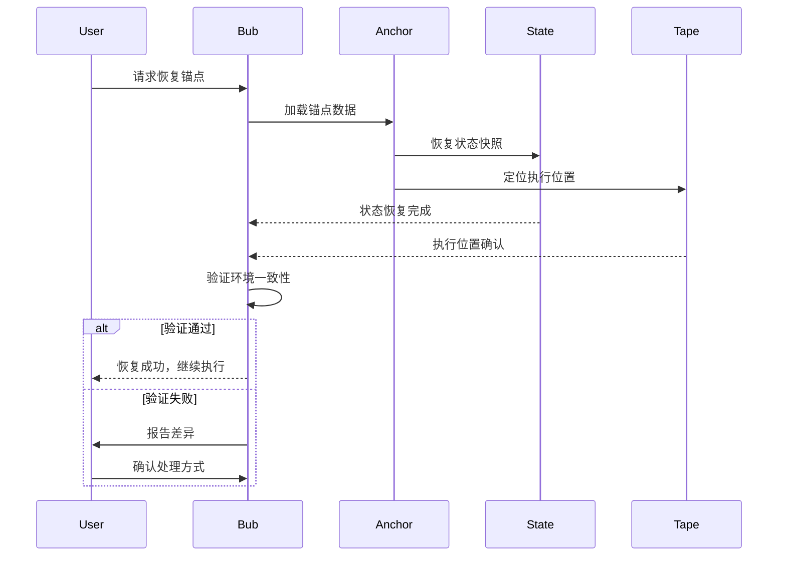
```mermaid
sequenceDiagram
    participant User
    participant Bub
    participant Anchor
    participant State
    participant Tape
    
    User->>Bub: 请求恢复锚点
    Bub->>Anchor: 加载锚点数据
    Anchor->>State: 恢复状态快照
    Anchor->>Tape: 定位执行位置
    
    State-->>Bub: 状态恢复完成
    Tape-->>Bub: 执行位置确认
    
    Bub->>Bub: 验证环境一致性
    
    alt 验证通过
        Bub-->>User: 恢复成功，继续执行
    else 验证失败
        Bub->>User: 报告差异
        User->>Bub: 确认处理方式
    end
```

---

## 6. 技能系统 (Skills)

Skills 是 Bub 的领域特定能力扩展机制。

### 6.1 技能结构

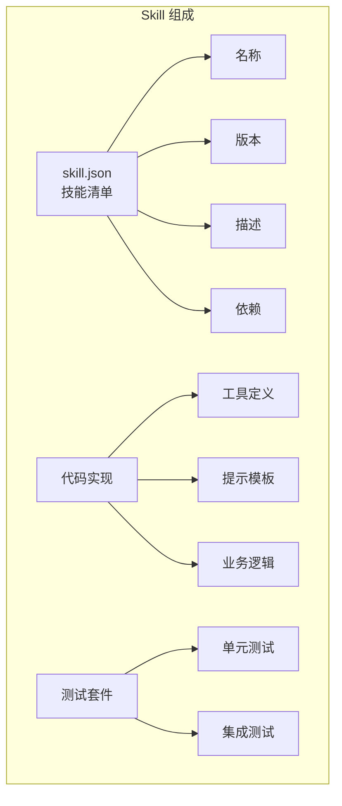
```mermaid
graph TB
    subgraph "Skill 组成"
        Manifest[skill.json<br/>技能清单]
        
        Manifest --> Name[名称]
        Manifest --> Version[版本]
        Manifest --> Description[描述]
        Manifest --> Dependencies[依赖]
        
        Code[代码实现]
        
        Code --> Tools[工具定义]
        Code --> Prompts[提示模板]
        Code --> Logic[业务逻辑]
        
        Tests[测试套件]
        
        Tests --> Unit[单元测试]
        Tests --> Integration[集成测试]
    end
```

---

### 6.2 技能加载与执行

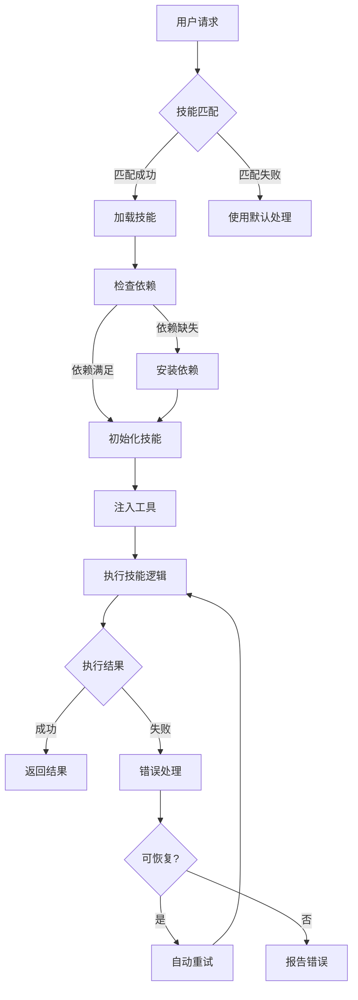
```mermaid
flowchart TD
    A[用户请求] --> B{技能匹配}
    
    B -->|匹配成功| C[加载技能]
    B -->|匹配失败| D[使用默认处理]
    
    C --> E[检查依赖]
    E -->|依赖满足| F[初始化技能]
    E -->|依赖缺失| G[安装依赖]
    G --> F
    
    F --> H[注入工具]
    H --> I[执行技能逻辑]
    
    I --> J{执行结果}
    J -->|成功| K[返回结果]
    J -->|失败| L[错误处理]
    L --> M{可恢复?}
    M -->|是| N[自动重试]
    M -->|否| O[报告错误]
    N --> I
```

---

### 6.3 技能示例：friendly-python

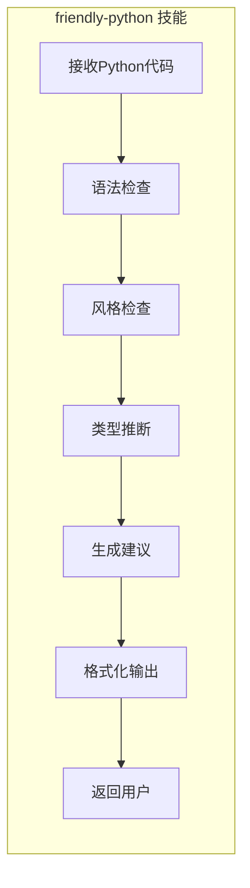
```mermaid
graph LR
    subgraph "friendly-python 技能"
        A[接收Python代码]
        
        A --> B[语法检查]
        B --> C[风格检查]
        C --> D[类型推断]
        D --> E[生成建议]
        
        E --> F[格式化输出]
        F --> G[返回用户]
    end
```

**命令**:
```
,skills.list                 # 列出可用技能
,skills.describe name=friendly-python  # 查看技能详情
```

---

## 7. 交接机制 (Handoff)

Handoff 允许将一个会话从一个 Agent 转移到另一个 Agent。

### 7.1 交接场景

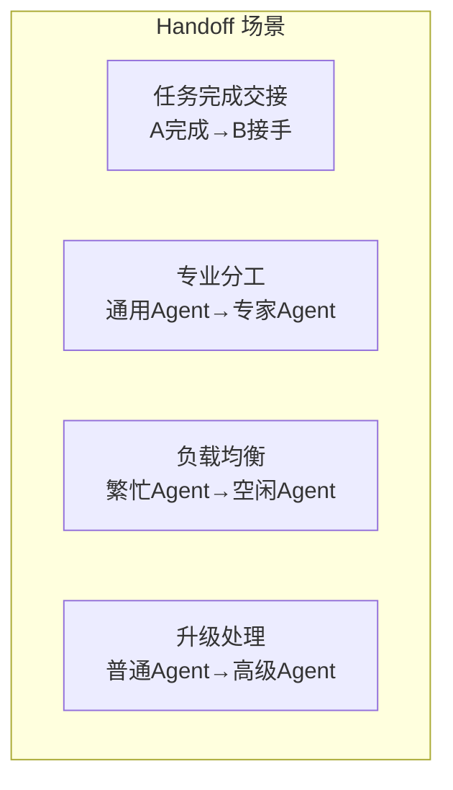
```mermaid
graph TB
    subgraph "Handoff 场景"
        S1[任务完成交接<br/>A完成→B接手]
        S2[专业分工<br/>通用Agent→专家Agent]
        S3[负载均衡<br/>繁忙Agent→空闲Agent]
        S4[升级处理<br/>普通Agent→高级Agent]
    end
```

---

### 7.2 交接流程

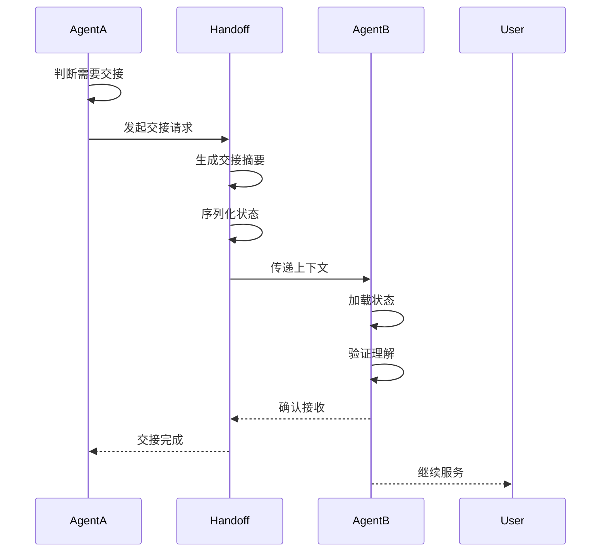
```mermaid
sequenceDiagram
    participant AgentA
    participant Handoff
    participant AgentB
    
    AgentA->>AgentA: 判断需要交接
    AgentA->>Handoff: 发起交接请求
    
    Handoff->>Handoff: 生成交接摘要
    Handoff->>Handoff: 序列化状态
    
    Handoff->>AgentB: 传递上下文
    AgentB->>AgentB: 加载状态
    AgentB->>AgentB: 验证理解
    
    AgentB-->>Handoff: 确认接收
    Handoff-->>AgentA: 交接完成
    
    AgentB-->>User: 继续服务
```

---

### 7.3 交接内容

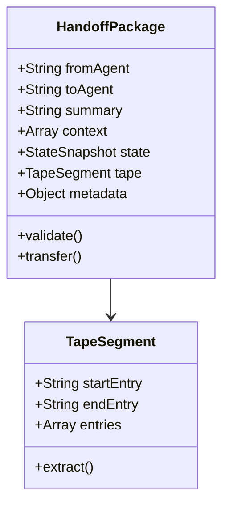
```mermaid
classDiagram
    class HandoffPackage {
        +String fromAgent
        +String toAgent
        +String summary
        +Array context
        +StateSnapshot state
        +TapeSegment tape
        +Object metadata
        +validate()
        +transfer()
    }
    
    class TapeSegment {
        +String startEntry
        +String endEntry
        +Array entries
        +extract()
    }
    
    HandoffPackage --> TapeSegment
```

**命令**:
```
,handoff name=phase-1 summary="bootstrap done"
```

---

## 8. 工具系统

### 8.1 工具调用流程

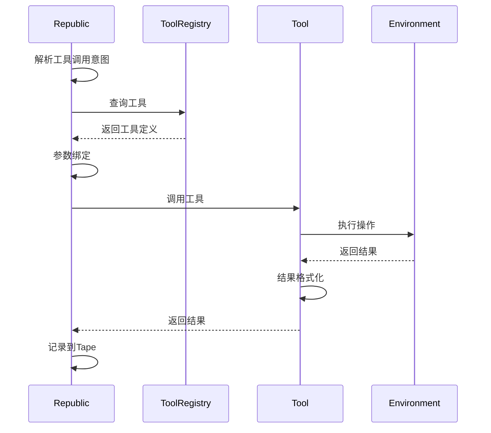
```mermaid
sequenceDiagram
    participant Republic
    participant ToolRegistry
    participant Tool
    participant Environment
    
    Republic->>Republic: 解析工具调用意图
    Republic->>ToolRegistry: 查询工具
    ToolRegistry-->>Republic: 返回工具定义
    
    Republic->>Republic: 参数绑定
    Republic->>Tool: 调用工具
    
    Tool->>Environment: 执行操作
    Environment-->>Tool: 返回结果
    
    Tool->>Tool: 结果格式化
    Tool-->>Republic: 返回结果
    
    Republic->>Republic: 记录到Tape
```

---

### 8.2 工具描述与发现

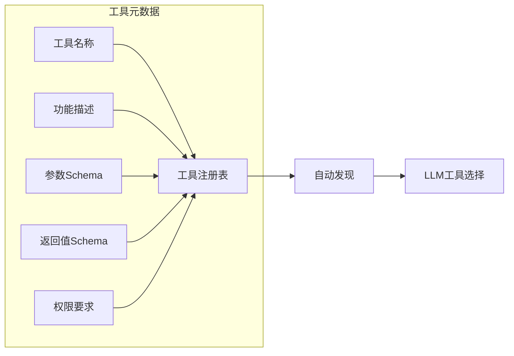
```mermaid
graph LR
    subgraph "工具元数据"
        A[工具名称]
        B[功能描述]
        C[参数Schema]
        D[返回值Schema]
        E[权限要求]
        
        A --> Registry[工具注册表]
        B --> Registry
        C --> Registry
        D --> Registry
        E --> Registry
    end
    
    Registry --> Discovery[自动发现]
    Discovery --> LLM[LLM工具选择]
```

**命令**:
```
,tools              # 列出工具
,tool.describe name=fs.read   # 查看工具详情
```

---

## 9. 与其他项目的对比

### 9.1 架构对比

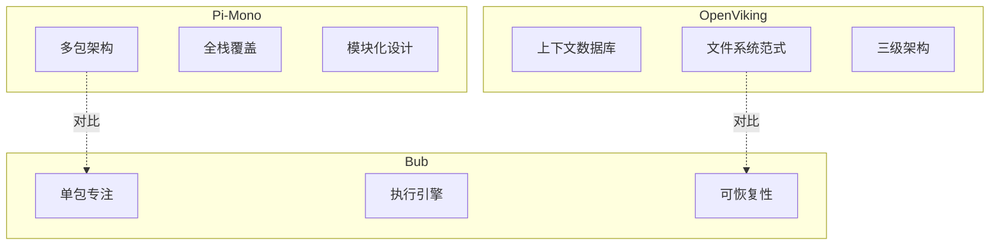
```mermaid
graph TB
    subgraph "Pi-Mono"
        P1[多包架构]
        P2[全栈覆盖]
        P3[模块化设计]
    end
    
    subgraph "OpenViking"
        O1[上下文数据库]
        O2[文件系统范式]
        O3[三级架构]
    end
    
    subgraph "Bub"
        B1[单包专注]
        B2[执行引擎]
        B3[可恢复性]
    end
    
    P1 -.->|对比| B1
    O2 -.->|对比| B3
```

---

### 9.2 能力矩阵

| 能力 | Pi-Mono | OpenViking | Bub |
|------|---------|------------|-----|
| LLM API 统一 | ✅ 强 | ⚠️ 需集成 | ⚠️ 需集成 |
| 上下文管理 | ⚠️ 基础 | ✅ 专业 | ✅ 可恢复 |
| 工具系统 | ✅ 丰富 | ❌ 无 | ✅ 可插拔 |
| 会话持久化 | ⚠️ 基础 | ✅ 自动 | ✅ 完整 |
| 可观测性 | ⚠️ 日志 | ✅ 可视化 | ✅ Tape |
| 多模型支持 | ✅ 强 | ⚠️ 需配置 | ⚠️ 需配置 |
| 工程可靠性 | ⚠️ 一般 | ⚠️ 一般 | ✅ 强 |

---

## 10. 值得深度挖掘的点

### 10.1 Tape 的调试价值

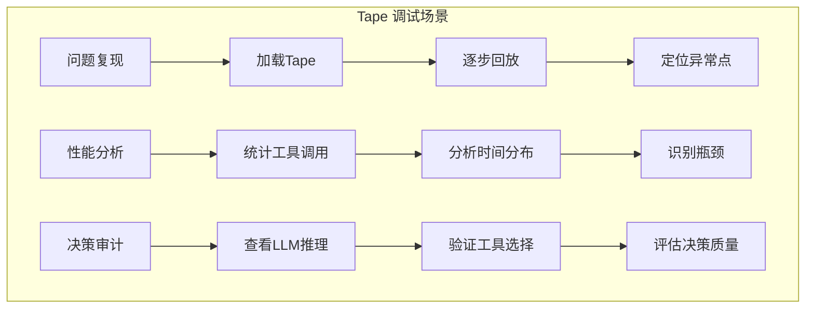
```mermaid
graph TB
    subgraph "Tape 调试场景"
        A[问题复现] --> B[加载Tape]
        B --> C[逐步回放]
        C --> D[定位异常点]
        
        E[性能分析] --> F[统计工具调用]
        F --> G[分析时间分布]
        G --> H[识别瓶颈]
        
        I[决策审计] --> J[查看LLM推理]
        J --> K[验证工具选择]
        K --> L[评估决策质量]
    end
```

**研究问题**: 如何设计高效的 Tape 查询和分析工具？

---

### 10.2 可恢复性的边界

```mermaid
graph TB
    subgraph "恢复边界条件"
        A[可恢复] --> B[纯计算状态]
        A --> C[文件系统状态]
        A --> D[本地内存状态]
        
        E[不可恢复] --> F[外部系统状态]
        E --> G[网络连接状态]
        E --> H[硬件依赖状态]
        
        I[部分恢复] --> J[需要重新认证]
        I --> K[需要重新连接]
    end
```

**研究问题**: 如何处理外部系统的状态恢复？

---

### 10.3 Republic 与 OpenClaw 的对比

```mermaid
graph LR
    subgraph "运行时对比"
        Republic[Republic<br/>Bub的引擎]
        OpenClaw[OpenClaw<br/>多通道网关]
        
        Republic -->|专注| A[单会话可靠性]
        OpenClaw -->|专注| B[多通道集成]
        
        A -->|互补| C[完整解决方案]
        B -->|互补| C
    end
```

**研究问题**: 如何将 Republic 的可靠性与 OpenClaw 的多通道能力结合？

---

## 11. 总结

Bub 代表了 AI Agent 的**工程化方向**:

1. **可靠性优先**: 可预测、可检查、可恢复
2. **生产就绪**: 长时间运行任务的完整支持
3. **可观测性**: Tape 系统提供前所未有的透明度
4. **可扩展性**: Skills 机制支持领域定制

**核心价值**: 让 Agent 从"玩具"变成"工具"。

**适合场景**:
- 长时间运行的复杂工程任务
- 需要审计和合规的企业环境
- 对可靠性要求高的生产系统
- 需要精确复现的调试场景

---

## 12. 三项目整合展望

```mermaid
graph TB
    subgraph "理想整合架构"
        Pi[Pi-Mono<br/>LLM API + Agent核心]
        Viking[OpenViking<br/>上下文管理]
        Bub[Bub<br/>可靠执行引擎]
        
        Pi -->|提供| A[多模型支持]
        Pi -->|提供| B[工具生态]
        
        Viking -->|提供| C[记忆系统]
        Viking -->|提供| D[上下文优化]
        
        Bub -->|提供| E[执行可靠性]
        Bub -->|提供| F[可观测性]
        
        A -->|组合| Platform[下一代Agent平台]
        B -->|组合| Platform
        C -->|组合| Platform
        D -->|组合| Platform
        E -->|组合| Platform
        F -->|组合| Platform
    end
```

这三个项目代表了 AI Agent 基础设施的不同维度，整合它们可以构建出**真正生产就绪**的 Agent 平台。
