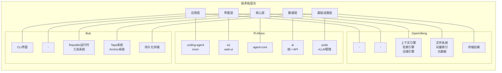
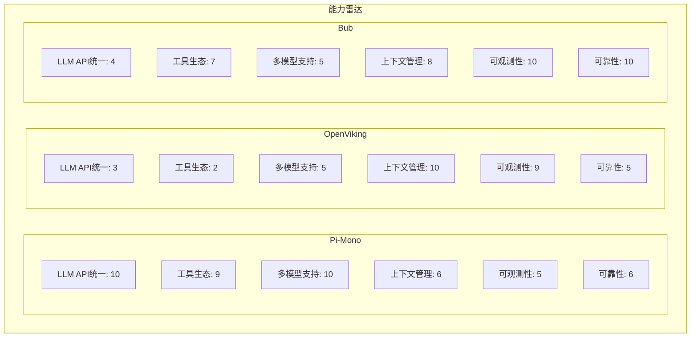
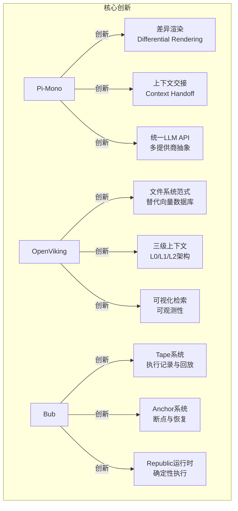
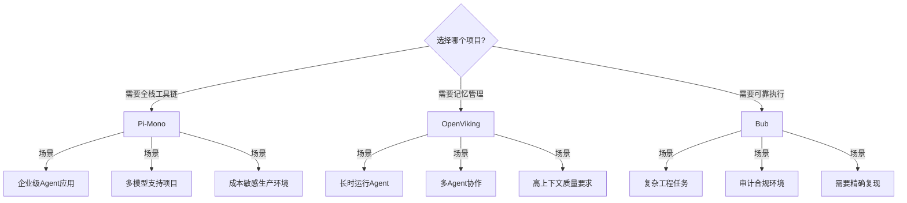
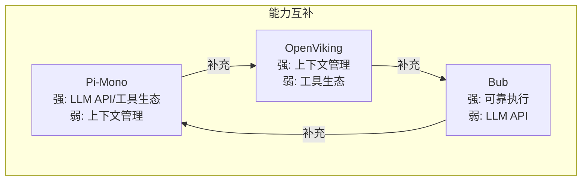
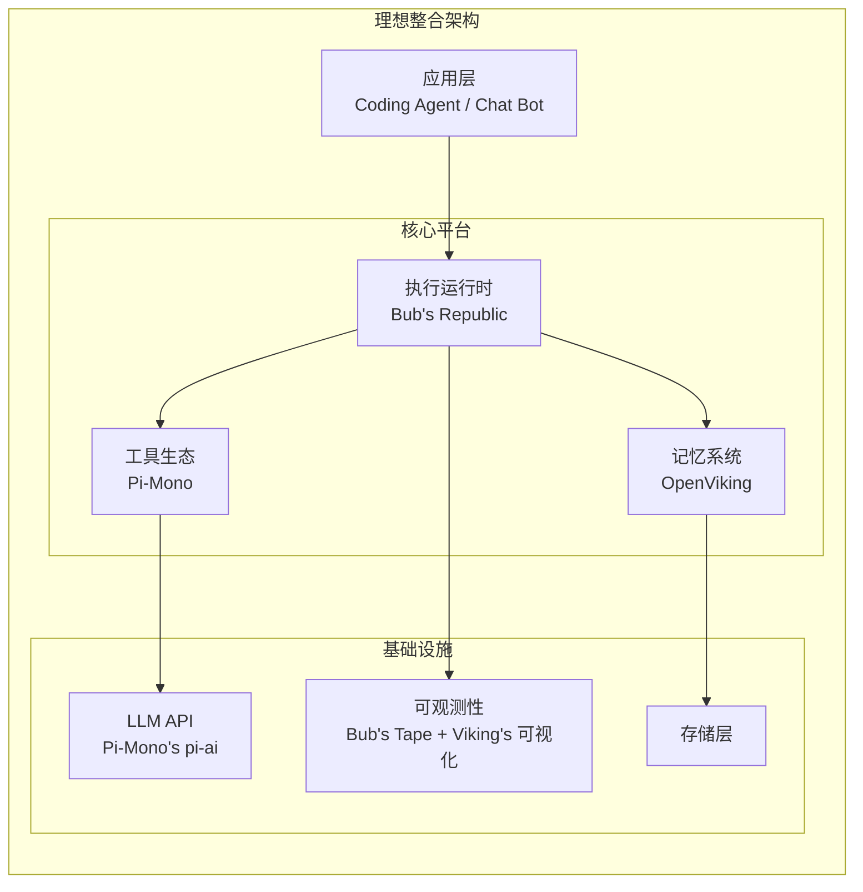
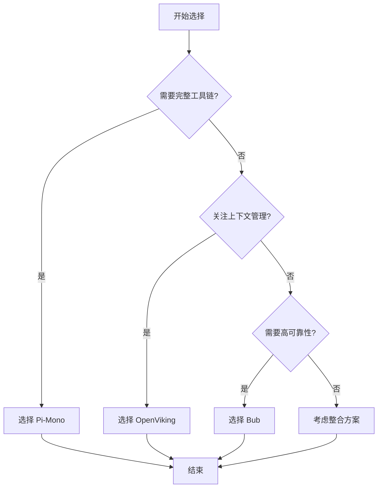
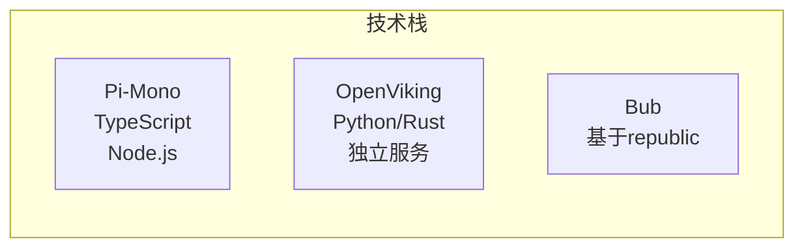

# 三项目对比与整合分析

> 深度对比 Pi-Mono、OpenViking、Bub 三个 AI Agent 相关开源项目

---

## 1. 项目定位对比

| 项目 | 定位 | 层次 | 特点 |
|------|------|------|------|
| **Pi-Mono** | 全栈工具包 | 应用层 | 大而全，模块化 |
| **OpenViking** | 上下文数据库 | 基础设施 | 专注记忆管理 |
| **Bub** | 可靠执行引擎 | 中间层 | 工程导向 |

### 1.1 核心定位

| 项目 | 一句话定位 | 解决的核心问题 |
|------|-----------|---------------|
| **Pi-Mono** | AI Agent 全栈工具包 | 从 LLM API 到应用的一站式开发 |
| **OpenViking** | Agent 上下文数据库 | 解决 Agent 的"记忆管理危机" |
| **Bub** | 可靠的 Coding Agent CLI | 让 Agent 执行可预测、可恢复 |

---

## 2. 架构层次对比

---

## 3. 核心能力对比

### 3.1 功能矩阵

### 3.2 详细对比表

| 维度 | Pi-Mono | OpenViking | Bub |
|------|---------|------------|-----|
| **主要语言** | TypeScript | Python/Rust | 未明确 |
| **架构模式** | Monorepo | 独立服务 | 单包专注 |
| **LLM 支持** | 多提供商统一 | 需集成 | 需集成 |
| **工具系统** | 丰富内置 | 无 | 可插拔 |
| **上下文管理** | 基础 | 专业（文件系统范式） | 可恢复（Tape系统） |
| **会话持久化** | 基础 | 自动压缩 | 完整支持 |
| **可观测性** | 日志 | 可视化检索轨迹 | Tape 完整记录 |
| **适用场景** | 全栈开发 | 长时任务记忆 | 可靠工程执行 |

---

## 4. 设计哲学对比

| 项目 | 核心理念 | 关键特点 |
|------|---------|---------|
| **Pi-Mono** | 提供完整的工具链 | 大而全、模块化、开发者体验、生产就绪 |
| **OpenViking** | 用文件系统管理记忆 | 范式创新、文件系统隐喻、可观测性、自动迭代 |
| **Bub** | 让 Agent 可靠运行 | 可靠性优先、可预测性、可检查性、可恢复性 |

### 4.1 核心理念对比

**Pi-Mono**: "提供完整的工具链"
- 从底层 API 到上层应用全覆盖
- 模块化设计，按需取用
- 类型安全，开发体验好

**OpenViking**: "用文件系统管理记忆"
- 创新的上下文管理范式
- 可视化、可解释、可迭代
- 让 Agent 越用越聪明

**Bub**: "让 Agent 可靠运行"
- 工程导向的设计理念
- 完整的执行记录和恢复机制
- 适合长时间运行的生产任务

---

## 5. 技术亮点对比

### 5.1 各自的核心创新

---

## 6. 适用场景对比

---

## 7. 整合价值分析

### 7.1 互补性分析

### 7.2 整合架构设想

---

## 8. 值得深度研究的方向

### 8.1 跨项目研究主题

| 研究方向 | 具体内容 |
|---------|---------|
| **上下文管理** | Pi的交接 vs Viking的文件系统 vs Bub的Tape；不同范式的适用边界；混合架构设计 |
| **可靠性工程** | Bub的确定性执行如何扩展；长时任务的容错机制；分布式Agent状态一致性 |
| **可观测性** | Tape记录 vs 可视化检索；执行轨迹分析工具；自动问题诊断 |
| **工具生态** | 统一工具描述协议；跨项目工具共享；工具市场构建 |

### 8.2 具体研究问题

1. **上下文范式对比**
   - Pi-Mono 的上下文交接 vs OpenViking 的文件系统 vs Bub 的 Tape
   - 三种范式各自的适用场景和边界
   - 能否设计一种统一的上下文抽象？

2. **可靠性分层**
   - Bub 的确定性执行如何与 Pi-Mono 的多模型支持结合？
   - OpenViking 的上下文压缩如何影响可恢复性？

3. **可观测性整合**
   - 如何将 Bub 的 Tape 与 OpenViking 的可视化检索结合？
   - 设计统一的执行轨迹查询语言

4. **工具生态互通**
   - 三个项目的工具能否互相使用？
   - 设计跨项目的工具描述标准

---

## 9. 项目成熟度评估

| 维度 | Pi-Mono | OpenViking | Bub |
|------|---------|------------|-----|
| **代码完整度** | ⭐⭐⭐⭐ | ⭐⭐⭐⭐ | ⭐⭐⭐ |
| **文档质量** | ⭐⭐⭐⭐ | ⭐⭐⭐⭐⭐ | ⭐⭐⭐ |
| **社区活跃度** | ⭐⭐⭐ | ⭐⭐⭐ | ⭐⭐ |
| **生产可用性** | ⭐⭐⭐⭐ | ⭐⭐⭐ | ⭐⭐⭐ |
| **推荐指数** | 高 | 高 | 中 |

### 9.1 成熟度分析

| 项目 | 代码完整度 | 文档质量 | 社区活跃度 | 生产可用性 | 推荐指数 |
|------|-----------|---------|-----------|-----------|---------|
| Pi-Mono | ⭐⭐⭐⭐ | ⭐⭐⭐⭐ | ⭐⭐⭐ | ⭐⭐⭐⭐ | 高 |
| OpenViking | ⭐⭐⭐⭐ | ⭐⭐⭐⭐⭐ | ⭐⭐⭐ | ⭐⭐⭐ | 高 |
| Bub | ⭐⭐⭐ | ⭐⭐⭐ | ⭐⭐ | ⭐⭐⭐ | 中 |

---

## 10. 总结与建议

### 10.1 项目选择建议

### 10.2 整合建议

**短期**:
- 在 Pi-Mono 基础上集成 OpenViking 的上下文管理
- 使用 Bub 的 Tape 系统增强可观测性

**中期**:
- 设计统一的 Agent 运行时接口
- 实现跨项目的工具共享机制

**长期**:
- 构建统一的 Agent 平台
- 建立开源社区协作机制

---

## 11. 附录：快速参考

### 11.1 项目链接

| 项目 | GitHub | 文档 | 作者 |
|------|--------|------|------|
| Pi-Mono | https://github.com/badlogic/pi-mono | 仓库内 | Mario Zechner |
| OpenViking | https://github.com/volcengine/OpenViking | 完整 | 字节跳动 |
| Bub | https://github.com/PsiACE/bub | 仓库内 | PsiACE |

### 11.2 技术栈速查

---

*文档生成时间: 2026-02-19*  
*版本: v1.0*
