# OpenViking 深度解析

> **仓库**: https://github.com/volcengine/OpenViking  
> **作者**: 字节跳动 (volcengine)  
> **定位**: 专为 AI Agent 设计的上下文数据库

---

## 1. 核心问题定义

OpenViking 要解决的是 AI Agent 开发中的**上下文管理危机**。

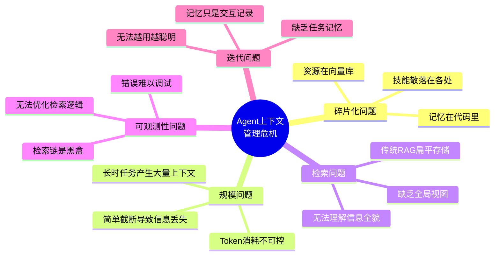

---

## 2. 核心理念：文件系统范式

OpenViking 的创新在于用**文件系统范式**替代传统的向量数据库范式。

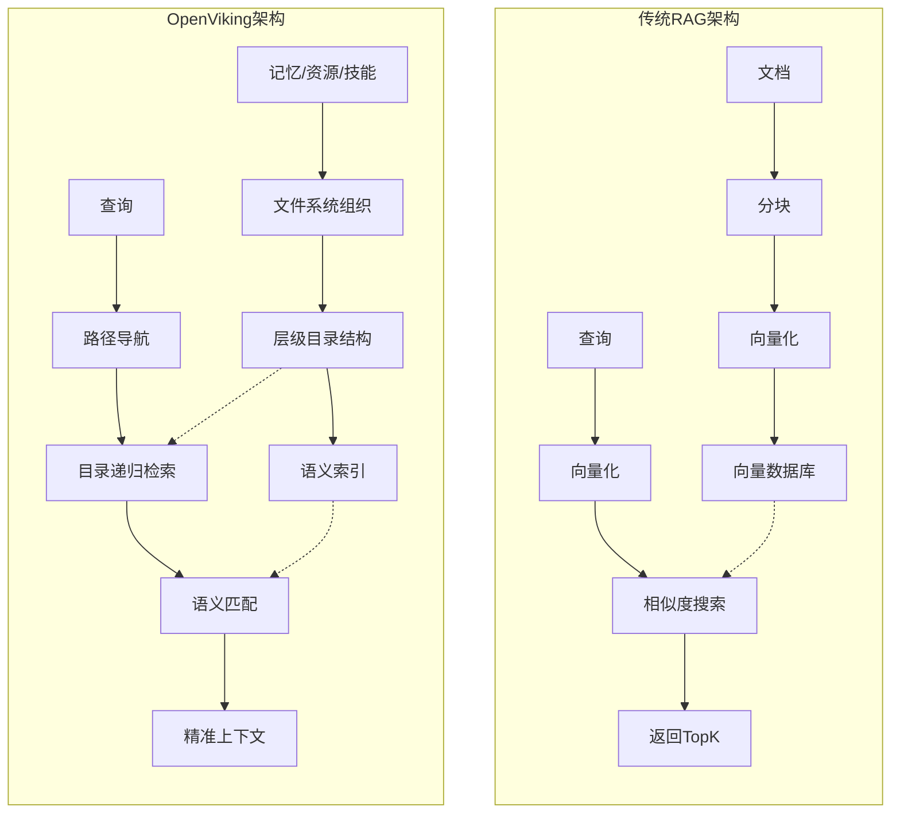

**关键区别**:

| 维度 | 传统RAG | OpenViking |
|------|---------|------------|
| 存储模型 | 扁平向量空间 | 层级文件系统 |
| 检索方式 | 相似度搜索 | 路径导航 + 语义搜索 |
| 上下文组织 | 无结构 | 目录/文件层级 |
| 可观测性 | 黑盒 | 可视化检索轨迹 |
| 记忆迭代 | 无 | 自动压缩提取 |

---

## 3. 三级上下文架构 (L0/L1/L2)

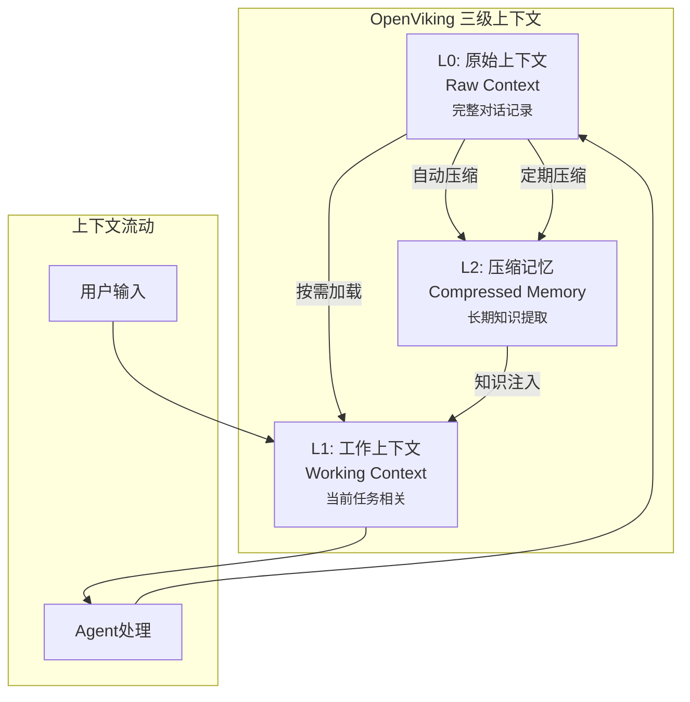

### 3.1 L0 - 原始上下文层

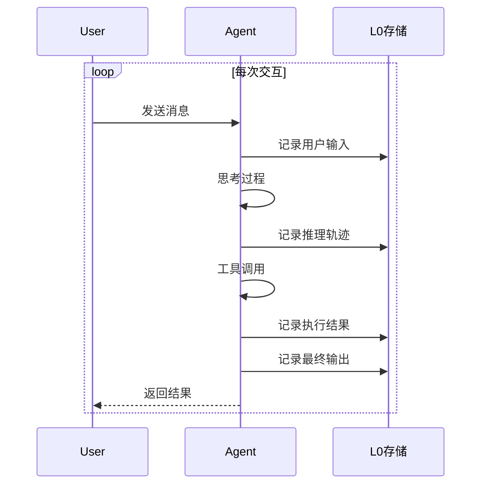

**特点**: 完整记录、不可变、用于审计和回溯

---

### 3.2 L1 - 工作上下文层

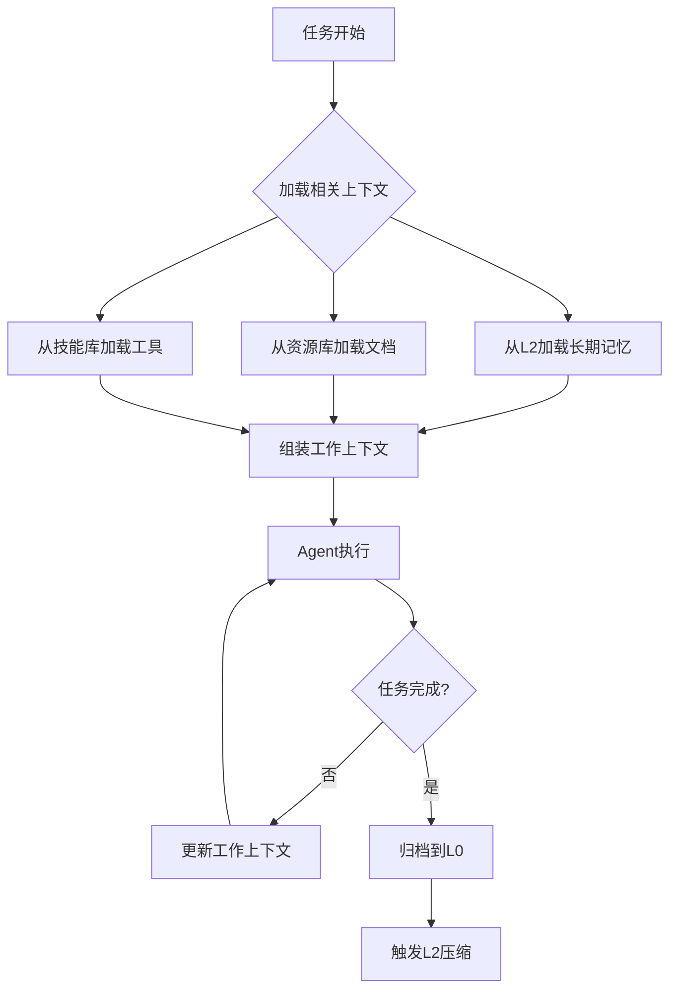

**特点**: 动态组装、按需加载、任务聚焦

---

### 3.3 L2 - 压缩记忆层

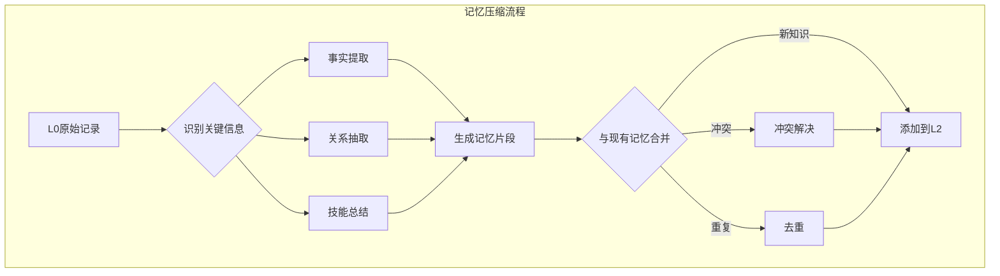

**特点**: 知识提取、长期存储、越用越聪明

---

## 4. 文件系统语义映射

OpenViking 将 Agent 的概念映射到文件系统：

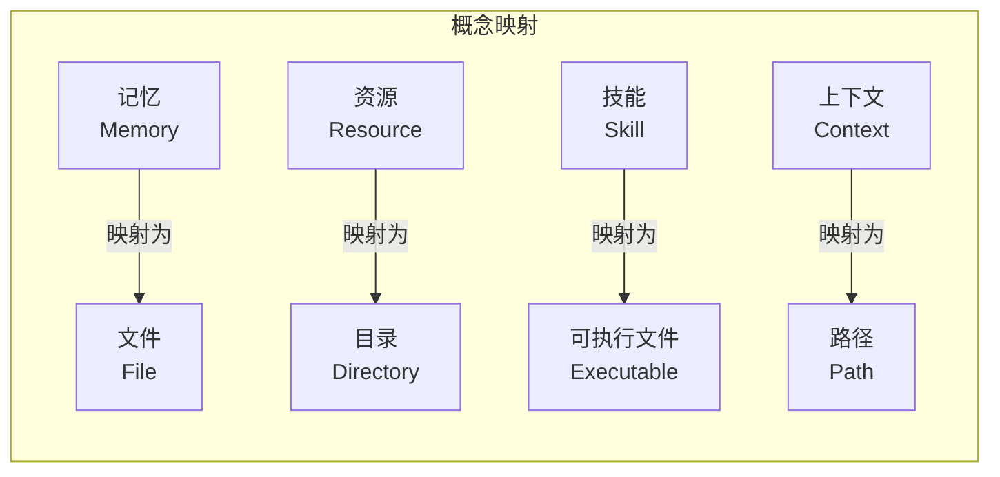

### 4.1 目录结构设计

```mermaid
tree
    root["/ (Agent根目录)"]
    root --> memories["/memories (记忆库)"]
    root --> resources["/resources (资源库)"]
    root --> skills["/skills (技能库)"]
    root --> sessions["/sessions (会话记录)"]
    
    memories --> user_profile["user_profile.md"]
    memories --> preferences["preferences/"]
    memories --> facts["facts/"]
    
    resources --> docs["docs/"]
    resources --> code["code/"]
    resources --> data["data/"]
    
    skills --> web_search["web_search.skill"]
    skills --> code_gen["code_gen.skill"]
    skills --> data_analysis["data_analysis.skill"]
    
    sessions --> session_001["2024-01-15_task_001/"]
    sessions --> session_002["2024-01-16_task_002/"]
```

---

## 5. 检索机制详解

### 5.1 目录递归检索

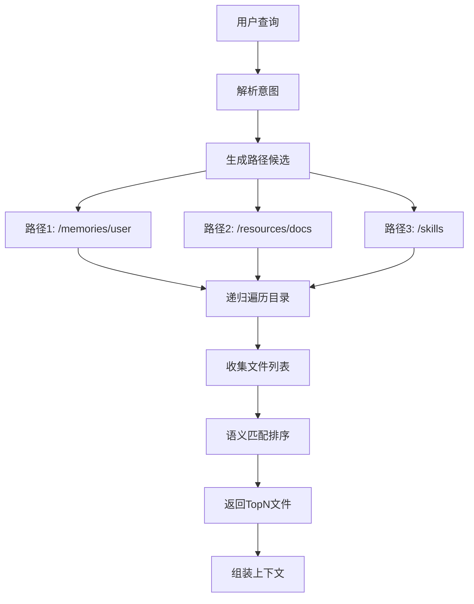

**优势**: 
- 利用目录结构缩小搜索范围
- 支持通配符和正则匹配
- 可解释性强（知道从哪里检索的）

---

### 5.2 可视化检索轨迹

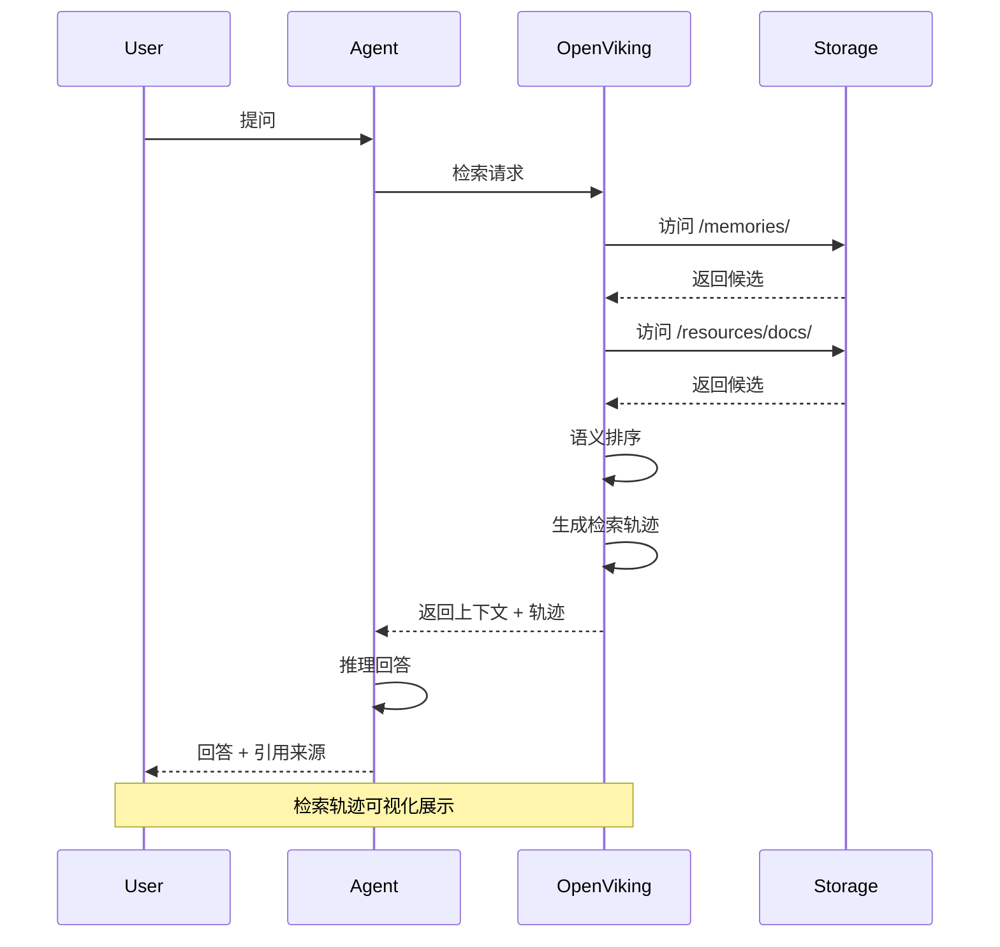

**可视化示例**:
```
检索路径:
  /memories/user_profile.md [匹配度: 0.92]
  /resources/docs/api_reference.md [匹配度: 0.87]
  /skills/code_gen.skill [匹配度: 0.75]

检索耗时: 23ms
Token节省: 相比全量加载节省 78%
```

---

## 6. 自动会话管理

### 6.1 会话生命周期

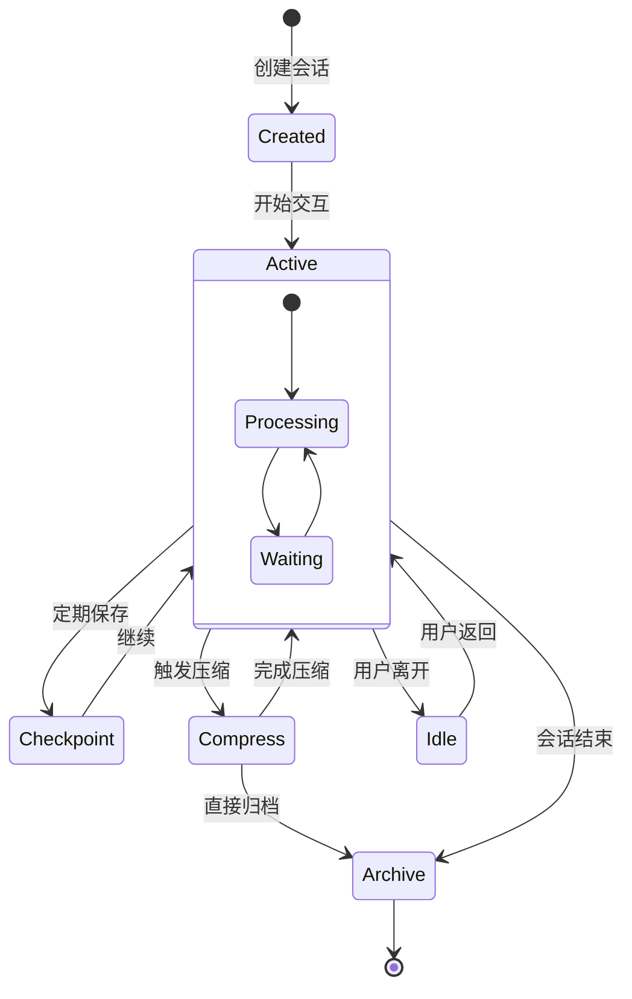

---

### 6.2 智能压缩策略

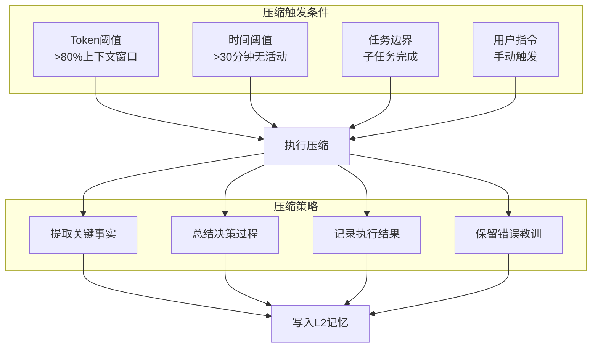

---

## 7. 架构组件详解

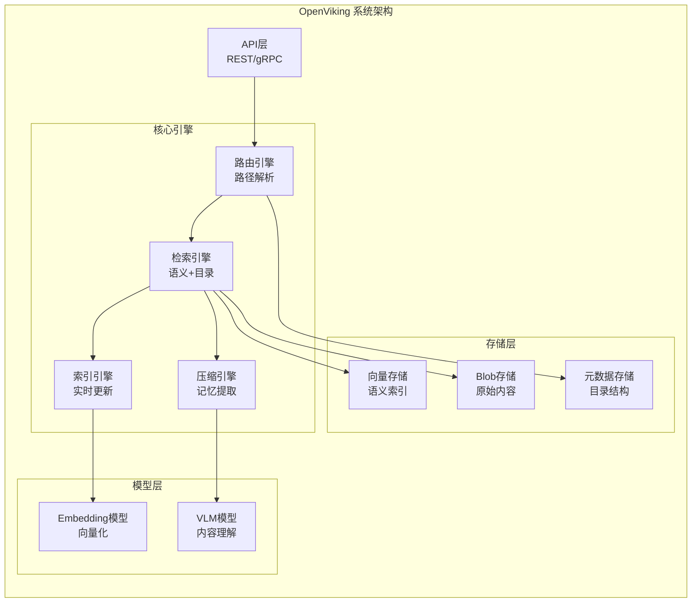

---

## 8. 值得深度挖掘的点

### 8.1 文件系统 vs 向量数据库的边界

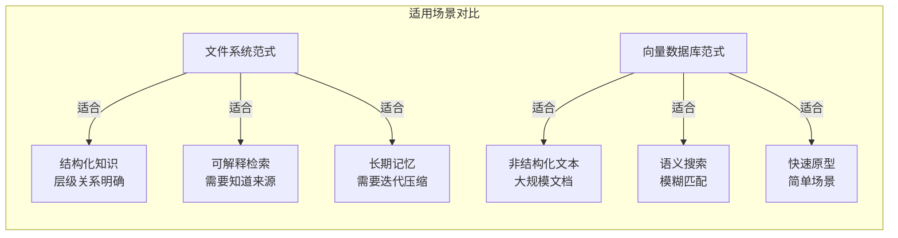

**研究问题**: 两种范式如何混合使用？各自的最佳边界在哪里？

---

### 8.2 记忆压缩的质量评估

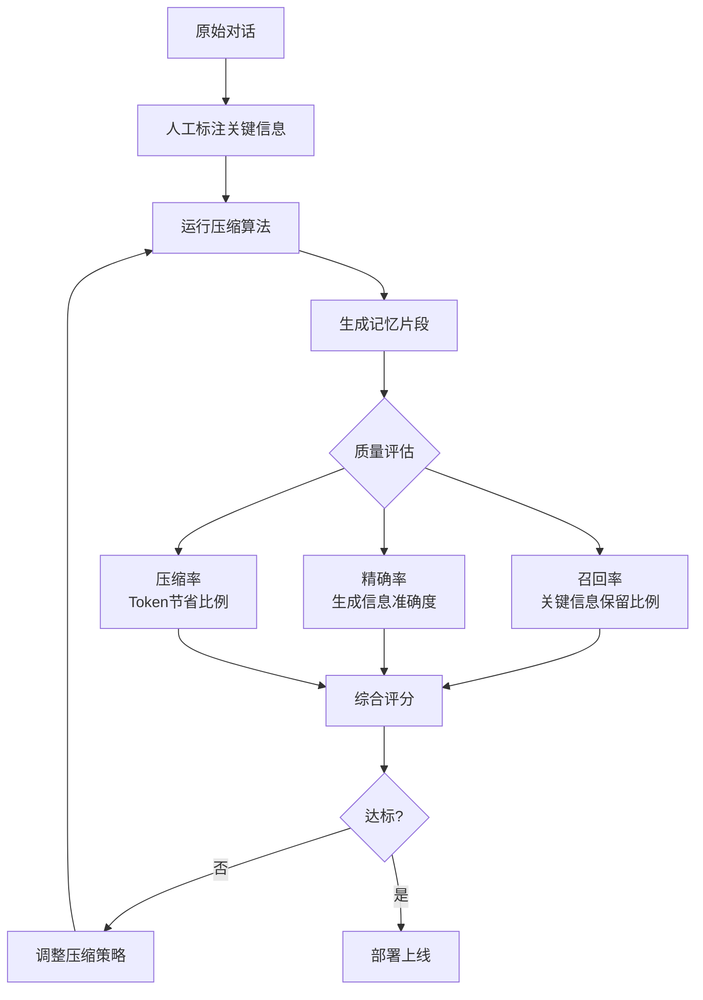

**研究问题**: 如何自动评估压缩质量？如何平衡压缩率和信息保留？

---

### 8.3 多 Agent 共享上下文

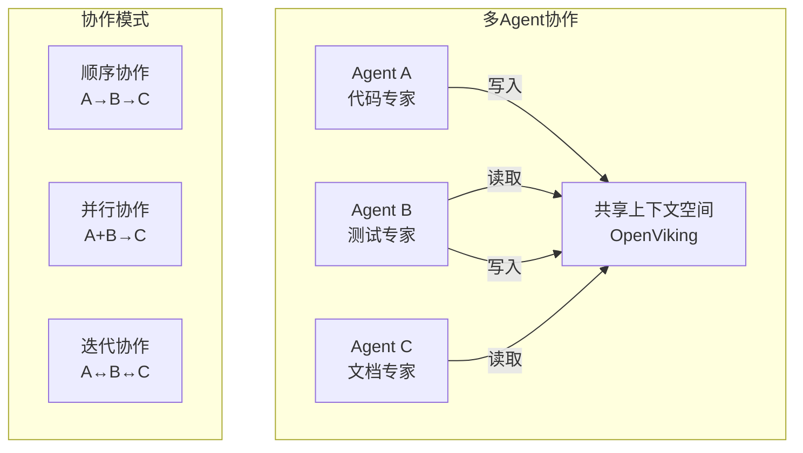

**研究问题**: 多 Agent 如何安全高效地共享上下文？如何解决冲突？

---

## 9. 与 Pi-Mono / Bub 的集成

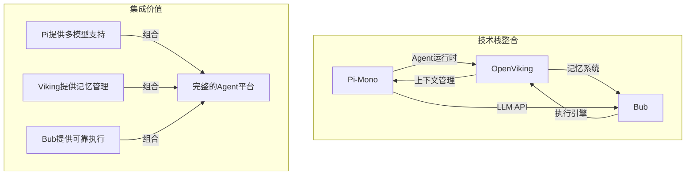

---

## 10. 总结

OpenViking 代表了 AI Agent 基础设施的**范式创新**:

1. **文件系统范式**: 用熟悉的概念解决复杂的上下文管理问题
2. **三级架构**: L0/L1/L2 分层处理不同生命周期的上下文
3. **可观测性**: 可视化检索轨迹，告别黑盒
4. **自动迭代**: 记忆自动压缩，Agent 越用越聪明

**核心价值**: 让开发者可以像管理文件一样管理 Agent 的"大脑"。

**适合场景**:
- 长时运行的复杂任务 Agent
- 需要强可解释性的企业应用
- 多 Agent 协作系统
- 对上下文质量要求高的场景
