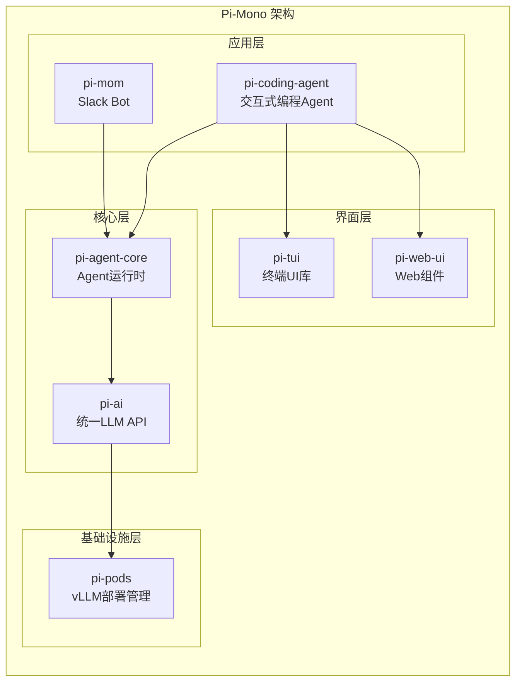
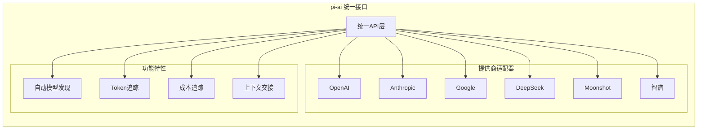
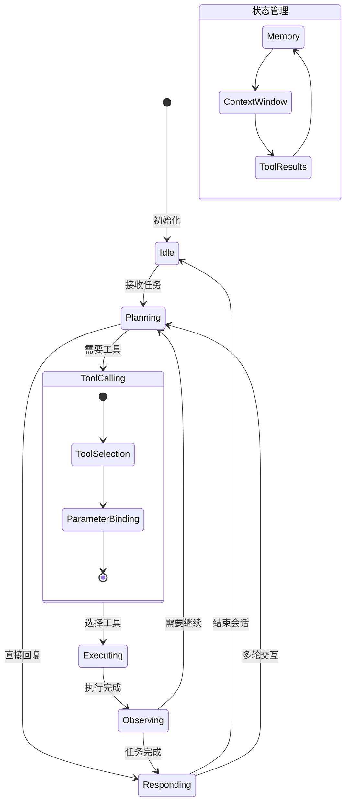
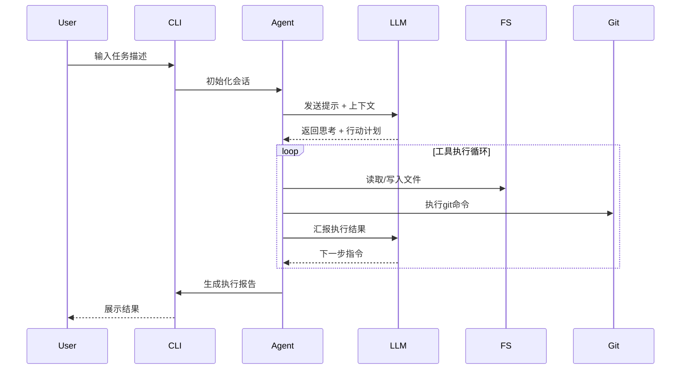
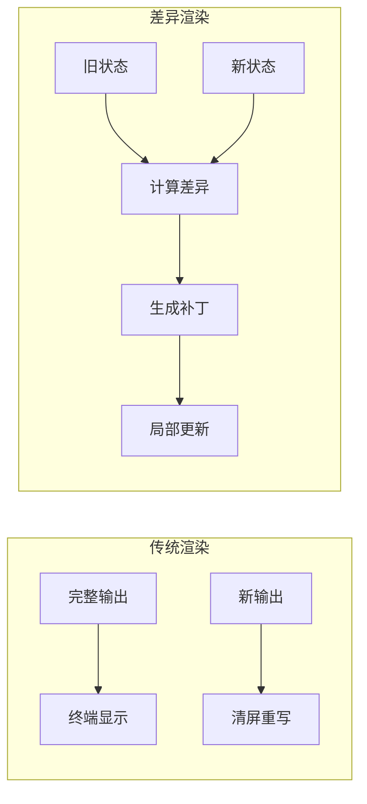
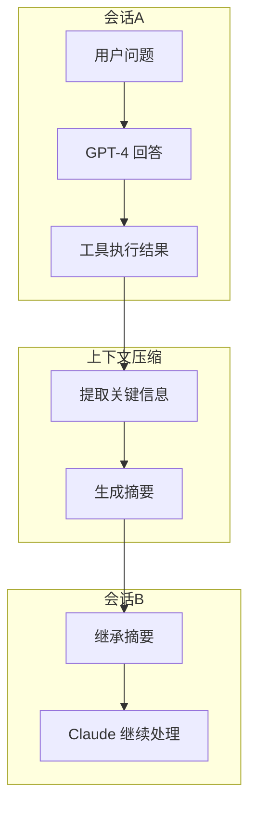
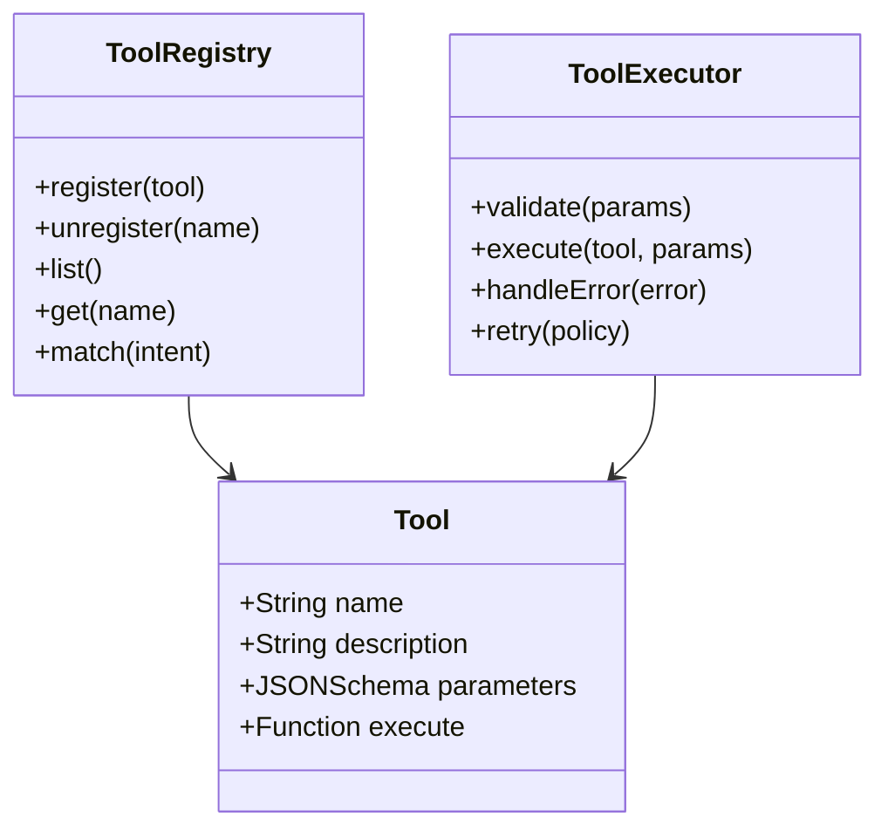
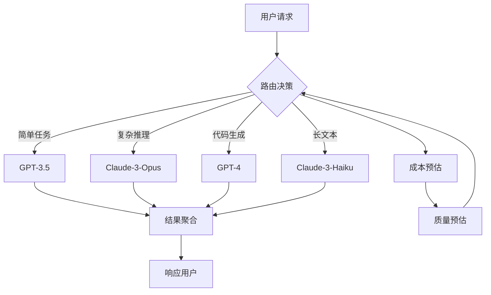
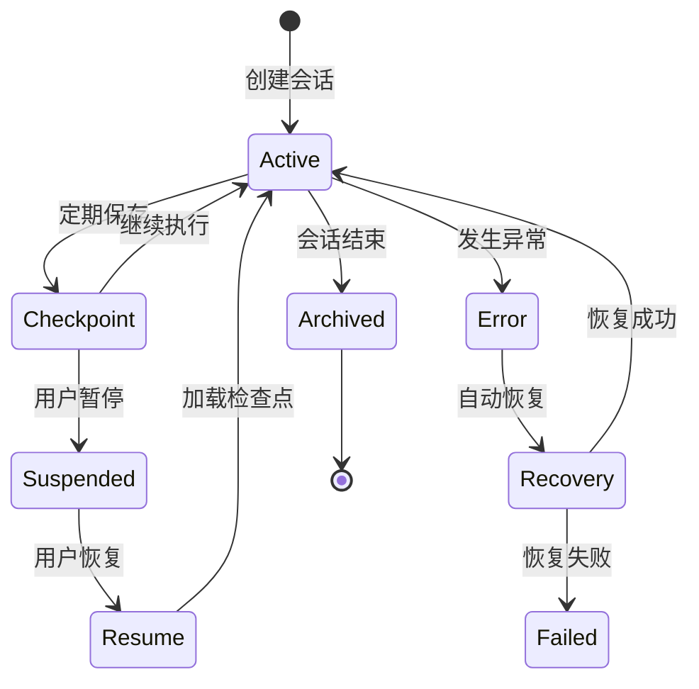
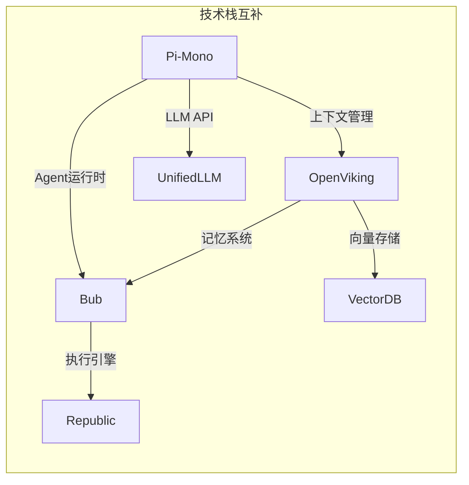

# Pi-Mono 深度解析

> **仓库**: https://github.com/badlogic/pi-mono  
> **作者**: Mario Zechner (badlogic)  
> **定位**: AI Agent 全栈工具包

---

## 1. 整体架构概览

Pi-Mono 采用 Monorepo 架构，将 AI Agent 开发所需的各个层次模块化封装。

---

## 2. 核心模块详解

### 2.1 pi-ai: 统一 LLM API

**设计亮点**:
- 自动模型发现：根据提供商自动枚举可用模型
- 上下文交接：支持在不同模型间传递对话上下文
- 成本追踪：精细化记录每个请求的 token 消耗和费用

---

### 2.2 pi-agent-core: Agent 运行时

**核心能力**:
1. **工具调用 (Tool Calling)**: 支持函数调用、代码执行、文件操作等
2. **状态管理**: 维护对话历史、工具执行结果、中间状态
3. **多轮规划**: 复杂任务自动分解为多步骤执行

---

### 2.3 pi-coding-agent: 交互式编程 Agent

**工作流程**:
1. **项目分析**: 自动读取项目结构、依赖、配置
2. **任务理解**: 解析用户意图，生成执行计划
3. **代码生成**: 编写、修改、重构代码
4. **验证测试**: 运行测试、检查语法、验证功能
5. **提交管理**: 自动 git 操作，生成提交信息

---

## 3. 技术亮点分析

### 3.1 差异渲染 (Differential Rendering)

**优势**:
- 减少终端闪烁
- 提升渲染性能
- 支持实时流式输出

---

### 3.2 上下文交接机制

**应用场景**:
- 模型切换：从 GPT-4 切换到 Claude 继续对话
- 成本优化：长对话压缩后使用 cheaper 模型
- 任务交接：不同 Agent 间传递任务上下文

---

## 4. 架构设计哲学

| 原则 | 具体体现 |
|------|---------|
| **模块化** | 单一职责、可插拔、独立发布 |
| **分层架构** | 清晰边界、依赖单向、可替换实现 |
| **开发者体验** | 类型安全、完整文档、丰富示例 |
| **生产就绪** | 错误处理、性能监控、可观测性 |

---

## 5. 值得深度挖掘的点

### 5.1 工具调用协议设计

**研究价值**: 如何设计一个既灵活又安全的工具调用机制？

---

### 5.2 多模型路由策略

**研究价值**: 如何在成本、延迟、质量之间做智能权衡？

---

### 5.3 会话持久化与恢复

**研究价值**: 长时运行 Agent 的容错与恢复机制

---

## 6. 与其他项目的关联

---

## 7. 总结

Pi-Mono 是一个**工程化程度很高**的 AI Agent 工具包，其价值在于：

1. **全栈覆盖**: 从底层 LLM API 到上层应用，一站式解决方案
2. **生产就绪**: 考虑到了成本追踪、错误处理、可观测性等工程要素
3. **模块化设计**: 可以按需取用，也可以整体使用
4. **类型安全**: TypeScript 实现，提供良好的开发体验

**适合场景**:
- 企业级 Agent 应用开发
- 需要多模型支持的项目
- 对成本和性能有要求的生产环境
